<h1>Griduino Kit Assembly Instructions</h1>

<h2>1. Introduction</h2>

Thank you for purchasing a Griduino GPS navigation kit. Once assembled, this kit is a useful driver's aid dedicated to show your location in the Maidenhead grid square system, your altitude, the exact time in GMT, barometric pressure and more. Further, the hardware is a highly capable platform for programming your own features.

These assembly instructions apply to Revision 4 of the printed circuit board.

<h2>2. You Will Need</h2>

This kit is almost entirely "through hole" construction. Two components, the battery holder and voltage regulator, are large surface-mount parts.

<h3>You must have:</h3>

* **Printed BOM and schematic diagram.** The component values are found on the bill of materials and the schematic. For example, to learn that R1 is a 22-ohm 2-watt resistor, you must find it in the BOM or schematic. These assembly instructions generally *don't* include part values in an attempt, possibly futile, to avoid multiple documents getting out of sync. The schematic is your ultimate golden master reference for all Griduino design. This is an open-source project and the latest documents are available on https://github.com/barry-ha/Griduino.
* **Fine-tipped soldering iron.** A standard fine-tipped iron suitable for use with conventional 0.1” pitch through-hole components.  It is recommended that you use a temperature controlled iron at a suitable temperature for your solder, if you have one. It is assumed that you will already have the necessary skills to solder this kit. If however you are not comfortable with through-hole electronic soldering, there are plenty of soldering tutorials available online.
* **Decent quality solder, with a flux core.**  Any decent quality, thin, flux cored solder designed for electronic use should be suitable for assembling this kit. Solder size 0.50 mm is ideal. Do not use solder intended for plumbing.
* **Needle nose pliers.** The component's leads must be bent with small pliers for a good fit into holes. Small pliers are also good for picking up the smallest parts from a tray.
* **Side cutters.** After you solder discrete components to the board, you will need to clip off the protruding wires. Wear eye protection and aim the bits away from you in a safe direction. 
* **Philips-head screwdriver.** There are four small screws to attach the PCB into the case.
* **Solderless breadboard.** To solder header pins onto small board assemblies, temporarily using a solderless breadboard will hold pins in correct alignment. 
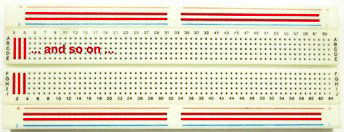

<h3>It will be nice to have:</h3>

* **Hobbyist bench vise.** You'll need a way to hold the PCB at a convenient height and angle for soldering parts. A small adjustable bench vise, such as a <a href="https://www.panavise.com/">Panavise Model 366</a>, will make your task easier. Use a holder wide enough to grip the Griduino PCB of 4-1/2" width. 
 
 
* **Craft knife.** The plastic case will need small cutouts for power and speaker wires to reach the connectors. A very careful application of a sharp small knife can trim out the holes you need. A craft detail knife such as Fiskars 165110-1002 has better safety and precision than Exacto knives. 

* **Blue painters tape.** While soldering things upside down, an easy-to-remove tape can temporarily hold parts onto the PCB. When you do this, solder only one pin, then double-check the parts are still tight on the PCB. If not, reheat the one pin and press on the part to re-seat it. Then solder the remaining leads. 
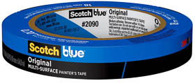

* **Tiny flat head screwdriver.** If you use the 4-terminal strip after assembly (optional), it needs an unusually narrow-bladed screwdriver to reach the recessed screw heads.

* **Ohmmeter.** Use an ohmmeter or VOM (volt-ohm-milliameter) to measure resistors before installation to help ensure you have the right one in the right place.

* **Scosche Magnetic Mount** You'll want a way to mount this in your vehicle within easy view of the driver. The Griduino case can most likely be adapted to almost any popular cellphone mounting system. A particularly convenient and interchangeable system is the **Scosche Magic Mount** product line. It has a magnetic base mounted to the dashboard, and a ferrous plate stuck on the back of a Griduino or cellphone. https://www.scosche.com/
 
<h2>3. Identifying the Components</h2>

Some of Griduino's hardware, such as the connectors and PCB, should be easy to identify. Every connector has a different footprint and will only fit one way.

There are two 8-pin DIPs (dual inline package) chips. Inspect the silkscreen label to identify which is which. Then look closely for a notch at one end -- this helps locate Pin 1. The notch must be oriented the same direction as the semicircle on the PCB.

Small 1N4001 diodes are marked with a band on one end for polarity; the band must be oriented the same direction as the band on the PCB. 

The larger zener diode is a TVS protection diode (transient voltage suppressor) for clamping voltage spikes from exceeding +25 or -25 volts. It is bidirectional (not polarized) and can be installed in either orientation.

Electrolytic capacitors are marked with an arrow or "-" to indicate the negative polarity terminal. Also note the "minus" lead is shorter than the other lead. The PCB locations are marked with a filled semicircle (minus) and a small "+" symbol on the other side. When you install electrolytics, mount them flush on the PCB; the image below has extra lead length to show the board markings.

Header pins can join a small PCB onto the main board. They are designed to let you break off the number you need. Use needle nose pliers to hold steady the pins you'll keep and use your fingers to snap off the rest.

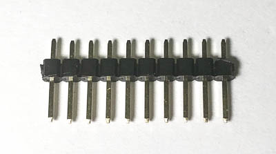

<h2>4. Construction Step-By-Step</h2>

You should now be ready to build your Griduino. Here is a step-by-step progression through the assembly process in a recommended order. This order is not compulsory, however it has been chosen to ensure that smaller components are fitted before larger components that may make them difficult to reach for soldering. It is **strongly recommended** that you only unpack one component at a time: that which you are currently installing.

<h3>Step 1: U3 Voltage Regulator</h3>

Start with the small 3-terminal voltage regulator. This is surface-mounted and not a "through hole" component so use a clothespin or surgical clamp or paper clip to hold it in place while soldering. 

Solder one pin to the board. Remove your clamp. Solder the remaining pins. 

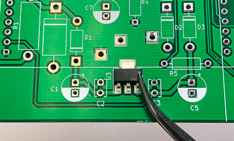

<h3>Step 2: Diodes</h3>

Insert the three small 1N4001 diodes, D1 - D3, being careful of polarity; match the banded end (cathode) with the board marking. The board also indicates the banded end with a square solder pad. It is good practice to bend its wires in such a way that its marking "4001" is on top and readable.

Solder the three diodes into place and snip off excess wire lengths.

<h3>*Step 3: Resistors</h3>

This kit uses five resistors, R1 - R5, each of a different value. Refer to the schematic or bill-of-materials for the values.

Measure the resistance of each item with your ohmmeter before installation. These resistors are very small and it's easy to mistake the color coded bands.

Insert resistor R1 - R5 onto the PCB. It is good practice to orient the color code bands in the same direction; this makes them easier to read.

Solder the five resistors and snip off excess wire lengths.

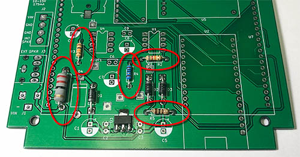

<h3>Step 4: Small 0.1 uF Capacitors</h3>

The four tiny 0.1 uF ceramic capacitors are all the same, but they're tiny so don't drop them. They are not polarized; however, it is good practice to orient their labels all in the same direction to make it easier to read their legends.

Solder the four small ceramic capacitors onto the PCB and snip off excess wire length.

<h3>Step 5: Electrolytic Capacitors</h3>

This kit has five identical 47 uF electrolytic capacitors. Be careful of polarity; incorrect installation can cause them to burst and leak acid. The PCB is designed so they are all installed in the same orientation. 

Don't substitute taller capacitors - although they would be electrically equivalent, they won't fit under the display board above them.

Solder only one lead of each electrolytic. Then check that the capacitor is flush with the board. If not, reheat the wire while pushing it down. Then solder the other lead. Snip off excess wire.

<h3>Step 6: U1 Volume DS1804 and U4 Audio LM386, 8-pin DIPS</h3>

The two 8-pin DIPs (dual inline package) are soldered directly to the board. It is recommended to *not* use a socket so that vibration does not cause them work loose over time. The notch on the chip must be aligned with the matching semicircle printed on the PCB.

Note: pins on the DIP are slightly wider than the PCB hole spacing. They are designed this way for pick-and-place machines that squeeze DIPS during assembly. You may find it helpful to manually compress the pins together ever so slightly before inserting into the board. Be gentle; if you press too hard the chip flips over and inserts its pins into your thumb.

Insert U1 Digital Potentiometer DS1804 and U4 Audio Amplifier LM386 into the PCB. Make sure each chip's notch is oriented to match the board's silkscreen. You may want to tack-solder a single pin from the top to hold the chip in place, before turning over the board to solder all the pins from the bottom.

<h3>Step 7: U2 Feather M4 Express</h3>

Test the Feather before using it. By testing first, we ensure it's usable before permanently installing it. To test it, plug a standard micro-USB cable into the Feather's onboard connector; the lights should show activity. If this is a new Feather, it comes with a factory program that shines the NeoPixel LED bright green every two seconds as a simple "hello world" program.

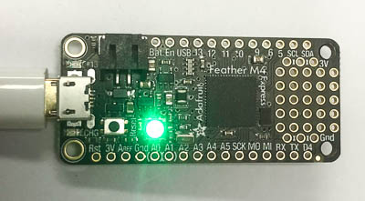

The Feather comes with two 16-pin header strips loose in the package. Take one strip and break off 4 pins so it exactly matches the Feather's pinout: one 12-pin strip, and one 16-pin strip. Temporarily put the strips into a solderless breadboard to hold them in precise alignment. The long end of the pins go down into the breadboard; the short end goes into the Feather's PCB. (Actually the long pins can go up *or* down, it doesn't matter. We like them down for a more tidy appearance from the top.) Solder the Feather board to both header pin strips.

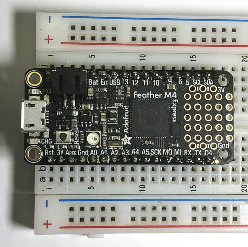

To remove the Feather from the breadboard, carefully work it upward gently from both ends. It can be helpful to pry it gently with a small screwdriver from underneath.

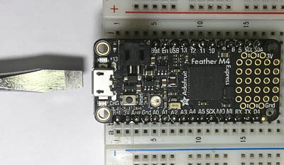

Insert the Feather board into the PCB. Make sure the pins are completely inserted and the Feather is held off the PCB by only the small black part of the header strip. 

<h3 style="color:darkred">Wrong:</h3>

<h3 style="color:green">Correct:</h3>

Solder the pins to the Griduino board. You don't need to clip off the long ends; there is ample room inside the case.

<h3>Step 8: U5 Ultimate GPS</h3>

The "Ultimate GPS" package shipped from Adafruit comes with a header strip and a battery holder.

* Count the pins on the supplied header strip. The GPS requires a 9-pin header and sometimes Adafruit may ship an 8-pin header. Add an extra pin from some extra strip, such as the one leftover from the Feather.
* Do not solder a battery holder onto the back of the GPS. It won't hurt anything to have this holder, but it will go unused. Its slot will be unreachable after all the parts are installed. Instead, the Griduino board is designed with a separate coin battery holder, BT1, to replace this one on the back of the Ultimate GPS board.

Insert a 9-pin header pin strip onto the Griduino PCB. Break off two single pins from a leftover strip and insert them into the other two corners. Do not solder them yet.

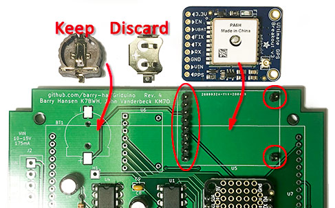

Lower the GPS onto the pins and solder the top pins. The two single pins in the corners only provide physical support and have no other functional purpose.

Tape the GPS assembly in place, if needed. Turn the board over and solder one pin. Check the GPS assembly is still tight to the board. If not, reheat the pin while pushing it down. Solder the remaining pins.

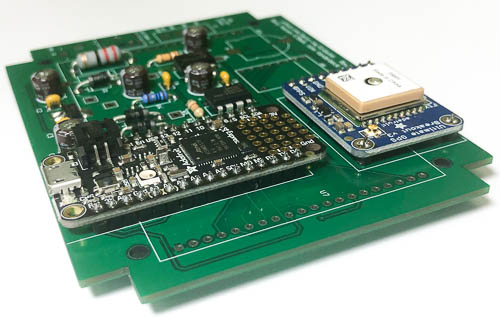

<h3>Step 9: Barometric Pressure Sensor</h3>
(Coming soon.)

<h3>Step 10: BT1 Battery Holder</h3>

Solder the battery holder onto the PCB. This is a surface-mount device so use a small clamp or clothespin (remember those?) or tape to temporarily hold it in place while soldering.

Don't insert a battery just yet. Do this at the end to avoid any chance of shorts during construction.

<h3>Step 11: U7 Display ILI9341</h3>

First, solder jumpers IM1/IM2/IM3 on the back of the board. All you have to do is melt a fat solder bridge across each "jumper". The traces are close together to make this easier. This enables the SPI interface. Do not solder jumper IM0.

Next, insert one 20-pin header into a solderless breadboard; this will be the functional interface to the display board. Break off two 2-pin headers and insert them in the breadboard aligned with the outer holes on the opposite side of the display; this will be to physically support the display. Solder the display board onto the pins.

Place a 20-pin socket onto the pins on both ends of the display. The display board will hold the sockets in correct alignment for the next step.

Put the prepared display, including the two 20-pin sockets, onto the PCB. It will be spanning all the parts underneath. Turn the assembly upside down and rest the display on a soft non-scratch surface with the pins to be soldered facing up. Solder the sockets on to the board. 

When finished, gently unplug the display from its sockets for safekeeping while working on other parts. Insert the display again later when everything else is completed.

<h3>Step 12: Test Points</h3>

(Coming soon)

<h3>Step 13: Connectors</h3>

Lastly, install and solder the power connector, speaker jack and 4-pin terminal strip into place. Most of these connectors extend slightly beyond the edge of the PCB, so we install them lastly to avoid interfering with your bench vise hardware. Use 

<h3>Step 14: Plastic Case</h3>

The Griduino kit comes with a plastic enclosure from <a href="https://www.polycase.com/">Polycase</a> in their QS Series that exactly matches the PCB mounting holes. Other enclosures could probably be used. If you choose something else, be sure to avoid metallic cases since they would block the microwave GPS signal.

*Bottom Half:* Screw the PCB onto the bottom half of the case. Use a craft detail knife to notch out a square hole for each of the three connectors (speaker, power, USB connector). The exact size depends on your particular cable that you choose to use.  For sake of sizing the hole, find a USB cable that has the largest connector available. 

*Top Half:* There are at least three choices for the top cover.

* No cover – this is how I use my Griduino.
* Polycase cover – carefully cut an opening to fit the display. You'll have to come up with your own cutting template. This is so difficult to do accurately and neatly that it is not recommended.
* 3D printed cover – The author designed a top cover to fit the Polycase bottom half. The 3d design files are available upon request so you can print and decorate your own.

<h3>Step 15: Speaker</h3>

You can connect a small 8-ohm or 4-ohm speaker to the stereo plugin jack or to the screw terminal strip.

Note that both the speaker jack and speaker plug must be standard stereo connectors. (Do not use a mono plug: it will result in muted or very low volume.) However, this kit can only generate a single audio channel and it is connected to both sides of the stereo jack.

If you have a speaker wired to the 4-screw terminal strip, it will automatically be disconnected when you plug something in to the audio speaker jack.

For a good audio quality speaker and sufficient volume to fill a car and overcome road noise, Adafruit part number 3351 is recommended. This small speaker can be glued to the back of Griduino case. 

Note that increased audio volume is available when powering the Griduino from a car’s electrical system with 10-15 vdc, compared to powering it from the 5v USB connector.

<h2>5. Before You Use It</h2>

Snap a coin cell battery (3-volt CR1220 lithium) into the battery holder.

Plug in the display board.

You should now have a completed Griduino GPS kit. Congratulations! 

Before you connect power, make a detailed visual inspection under a magnifier and good light. Pay close attention to any solder bridges that may have formed between adjacent pads. Remove any surplus solder or solder bridges with desoldering braid. 

A visual check **very important** because any short circuits or solder bridges can damage the power supply, the battery, or the Feather M4. **If that happens it is your responsibility as the builder of the board.** It is better to have to rework or desolder something than to damage it. 

Visually check that the display is correctly plugged in to its two sockets. Look for isolated pins at each end that are not engaged in the socket. If it is accidentally mis-aligned onto the wrong pins, the power supply circuit is likely to be damaged. (Don't ask us how we know.)

<h2>6. First Power Up</h2>

Connect a micro-USB cable to the Feather M4 Express connector. If this is a factory-fresh Feather, you should see:

* Backlight turns on for the display
* Yellow LED flashes rapidly
* NeoPixel LED flashes green once per second
* No text or graphics is shown on the display
* No audio is produced by the speaker

<h2>7. Programming the Griduino GPS</h2>

To load the Griduino programming onto your device, please refer to the open-source project on GitHub:

https://github.com/barry-ha/Griduino

Find the PROGRAMMING.md file for complete programming instructions.

The Griduino hardware platform offers a great deal of capability with a bright colorful display, powerful cpu, GPS receiver, barometric sensor, and a digital audio channel. We hope you invent fun and useful new things for it to do.

You may find the "examples" folder useful. It contains a variety of smaller programs that were used to develop certain concepts and check out features. For example, the barograph display can be a handy desktop application, showing the last 48 hours of barometric pressure and 1-hour and 3-hour trends.

<h2>8. Using the Griduino GPS</h2>

After loading and running the Griduino program, touch the top half of the screen to advance from one view to the next:

1. Power-up animation (one time only) 

2. Credits screen (one time only) 

3. Grid location view 

4. Grid details view 

5. GMT clock view 

6. Audio volume control 
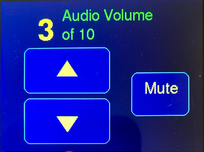

7. Settings 

Touch the bottom half of the screen to adjust brightness levels.

Griduino has non-volatile storage to save your breadcrumb trail (driving track) from one day to the next. 

For a demonstration, bring up the **Settings** view. Change the Route to **Simulator** and return to the main grid view. It follows a pre-programmed route to show the breadcrumb trail and what happens at grid crossings. There are a few different routes available, which can be selected at compile-time. The most interesting canned route will drive in a big ellipse near the edges of one grid square. 

When you cross a grid line, the new grid is announced with CW on the speaker.

When you arrive at a destination, you can switch to the GMT clock view. This is useful to visually compare to your computer clock for accurate time.

<h2>9. Disclaimer</h2>

The information provided is for general education and entertainment. We hope you learn from this and enjoy your hobbies in a safe manner with this new GPS information available at a glance. We take no responsibility for your assembly and construction, nor for how you use these devices. In particular, **do not adjust Griduino while driving**. Keep your eyes on the road. We can not be held responsible for any property or medical damages caused by these projects. You are advised to check your local laws and consult professionals for any project involving electricity, construction or assembly. You are advised to drive in a safe and legal manner, consistent with all local laws, safety rules and good common sense.

You must accept that you and you alone are responsible for your safety and safety of others in any endeavor in which you engage. 
