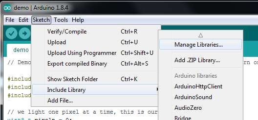
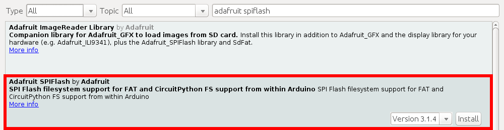
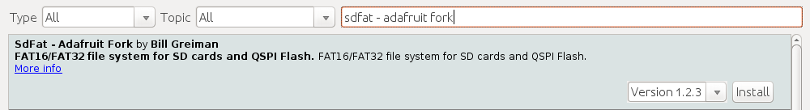
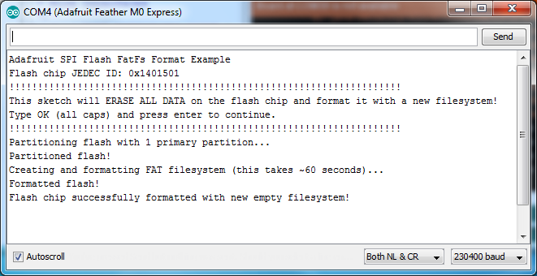
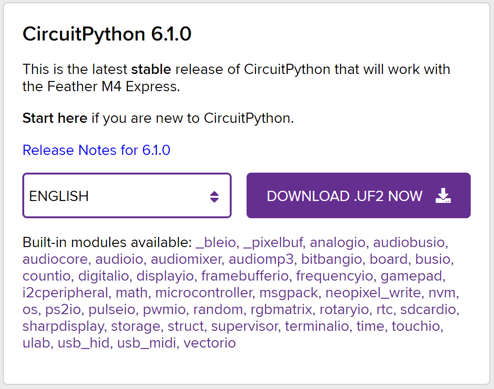

# Audio_QSPI
A library to open and play Microsoft WAV audio PCM files from Quad-SPI memory on Feather M4 Express.

This is the audio programming guide and library that I wanted (needed!) when I started using WAV files on the Feather M4 Express. It was a long process to pull together all the different parts of:

   - creating sound bites, 
   - storing WAV files on the Feather M4,
   - decoding WAV file headers, and 
   - playing audio via the built-in DAC (digital to analog converter).

I hope this library is useful or at least illustrates some techniques. Drop me an email if you like it or need a feature. The information presented here is available if you look long enough on the web, but it's spread out or tantalizingly inapplicable. For example, the Audio library by Paul Stoffringeng is a brilliant and highly polished set of features but it only works on the Teensy (not the Feather M4).

To keep it simple, this library is designed for short audio clips of less than 2 seconds each. It plays WAV files on the main level and blocks the main thread until it finishes. It does not use interrupts. It has only been tested with 16-bit PCM audio files at 16 KHz.

This library was developed for the Griduino project, a device for a vehicle's dashboard. Along with many other features, it announces its location by speaking letters and numbers using the NATO Military Phonetic Alphabet.

   - Griduino runs on the Feather M4 Express, https://www.adafruit.com/product/3857
   - Griduino software is an open-source project, https://github.com/barry-ha/Griduino
   - Griduino kits are available, https://www.griduino.com.

## Using SPI Flash Memory
One of the best features of Adafruit's "Express" boards is a small SPI flash memory chip built into the board.  This memory can be used for almost any purpose like storing data files, Python code, and more.  Think of it like a little SD card that is always connected to the board, and in fact with Arduino you can access the memory using a library that is very similar to the [Arduino SD card library](https://www.arduino.cc/en/reference/SD).  You can even read and write files that CircuitPython stores on the flash chip. 

We will rely on compatibility with CircuitPy to help us copy files from Windows into flash memory so they can be used by Arduino IDE programs.

1. To use the flash memory with Arduino you'll need to install the [Adafruit SPI Flash Memory library](https://github.com/adafruit/Adafruit_SPIFlash) in the Arduino IDE.

1. Open up the Arduino library manager. 

1. Search for the **Adafruit SPIFlash** library and install it. 

1. Search for the **SdFat - Adafruit Fork** library and install it. 

There are more tutorials on Arduino library installation at:
http://learn.adafruit.com/adafruit-all-about-arduino-libraries-install-use
 
## Format Flash Memory
To format Flash memory, all it needs is to **install CircuitPython once**. The first time it runs on your Feather M4, it will erase the memory and format the Flash chip in exactly the way we need. Note it may take a minute or two to format the first time.

The subsequent times that CircuitPython is loaded, it will not erase any files. Any files written by Arduino IDE programs are available to CircuitPy programs, and vice versa. 

Footnote: The **fatfs\_circuitpython** sketch is useful if you'd like to wipe everything away and start fresh, or get back to a good state if the memory should get corrupted for some reason.

Do not use fatfs\format or fatfs\_erase - the resultant file system is not compatible with Arduino IDE programs. 

If you need to format flash memory again:

1. Run the Arduino IDE

1. Click Menu > File > Examples > Adafruit SPIFlash > SDFat CircuitPython You should get a new Arduino IDE window.

1. Compile and upload to the Feather M4 Express board

1. Open the serial monitor at 115200 baud. You should see the serial monitor display a message asking you to confirm formatting the flash. 

1. If you don't see this message then close the serial monitor, press the board's reset button, and open the serial monitor again.

1. Type OK and press enter in the serial monitor input to confirm that you'd like to format the flash memory. You need to enter OK in all capital letters.

1. Once confirmed the sketch will format the flash memory. The format process takes about a minute so be patient as the data is erased and formatted.  You should see a message printed once the format process is complete.  At this point the flash chip will be ready to use with a brand new empty filesystem.

## Accessing SPI Flash
Arduino doesn't have the ability to show up as a 'mass storage' disk drive. So instead we must use CircuitPython to do that part for us. Here's the full technique:

1. Get the latest **circuitpython uf2 file** for your board (Feather M4 Express) from https://circuitpython.org/downloads At time of writing, this is version 6.1.0 named "adafruit-circuitpython-feather_m4_express-en_US-6.1.0.uf2"  

1. Start the bootloader on the Express board. 

1. Drag over the latest circuitpython uf2 file After a moment, you should see a CIRCUITPY drive appear as an external "hard drive" with a few files already on it.

1. ?Now go to Arduino and upload the fatfs_circuitpython example sketch from the Adafruit SPI library. Open the serial console. It will successfully mount the filesystem and write a new line to data.txt 

arduino_circuitpysketch.png

1. Back on your computer, re-start the Express board bootloader, and re-drag circuitpython.uf2 onto the BOOT drive to reinstall circuitpython

1. Check the CIRCUITPY drive, you should now see data.txt which you can open to read!

arduino_datatext.png

? Once you have your Arduino sketch working well, for datalogging, you can simplify this procedure by dragging CURRENT.UF2 off of the BOOT drive to make a backup of the current program before loading circuitpython on. Then once you've accessed the file you want, re-drag CURRENT.UF2 back onto the BOOT drive to re-install the Arduino sketch!

## How to Prepare Audio Files
Prepare a WAV file to 16 kHz mono:

1. Install free open-source [Audacity software](https://www.audacityteam.org/download/) 
1. Open Audacity.exe
1. Open a recording or a project, e.g. \Documents\Arduino\libraries\Audio\_QSPI\audio\original\phonetic_alphabet.aup
1. Select "Project rate" of 16000 Hz
1. Select an audio fragment, such as spoken word "Charlie"
1. Menu bar > Effect > Normalize:
   1. Remove DC offset
   1. Normalize peaks -1.0 dB
1. Menu bar > File > Export > Export as WAV
   1. Save as type: WAV (Microsoft)
   1. Encoding: Signed 16-bit PCM
   1. Filename = e.g. "c-bwh-16.wav"
1. The output file contains 2-byte integer numbers in the range -32767 to +32767

## How to Transfer Audio Files
1. Format QSPI file system to CircuitPy format (one time). Formatting is only done once; it erases everything on the memory chip, formats it, and then the file system will remain compatible with both CircuitPy and Arduino IDE frameworks thereafter.

1. To save files from Windows onto the QSPI memory chip on Feather M4 Express:
   1. Temporarily load CircuitPy onto the Feather
   1. Drag-and-drop files from within Windows to Feather
   1. Then load your Arduino sketch again.
   
## How to Examine Flash File System on Feather M4
After transferring files to the Quad-SPI memory chip, you'll want to confirm what has been stored in the SD file system. Here's how...

_todo - link to the Griduino example "Flash\_file\_directory\_list"_

## How to Read WAV File Header
Some Arduino programs may want to read attributes from the WAV file. For example, it may want to show the file size, bit rate, mono/stereo, and other characteristics. This is useful for at least debugging purposes. 

Call the **getInfo()** method to fetch metadata from a WAV file. Here's how...

    Audio_QSPI flash;
    flash.begin();
    
    WaveInfo info;
    flash.getInfo(&info, "/audio/letter_c.wav");

	Serial.print("File name ");       Serial.println(info.filename);
    Serial.print("File size ");       Serial.println(info.filesize);
    Serial.print("Samples/second ");  Serial.println(info.samplesPerSec);
    Serial.print("Number samples ");  Serial.println(info.numSamples);

See notes in the section below.

## How to Play WAV Files
This might be what you really came here for: reading a WAV file from Flash memory and playing it on the Feather M4.

Call the **play()** method to send PCM sampled audio to the Feather's DAC pin. Here's how...

    Audio_QSPI flash;
    flash.begin();
    
    char myfile[] = "/audio/letter_c.wav"
    flash.play(myfile);

Note:

- File name limited to 32 bytes
- File names are case sensitive
- All files are closed; the caller does not do any file management
- Function "play()" does not return until it's finished
- An internal buffer limits audio playback to 32000 samples (i.e. 2 seconds at 16,000 samples/sec)
- Currently only supports mono (not stereo)
- Currently only supports 16 KHz PCM

