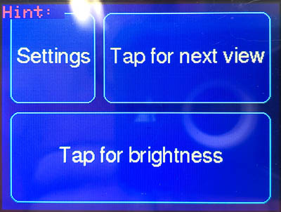
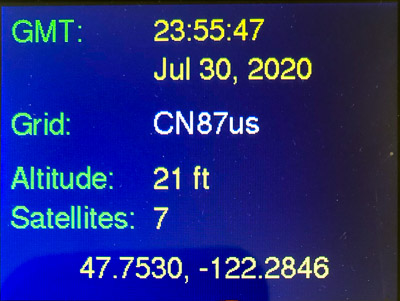
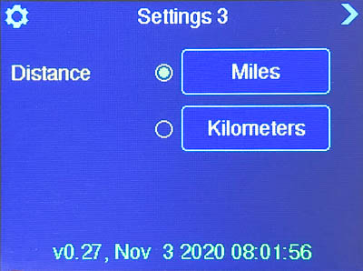
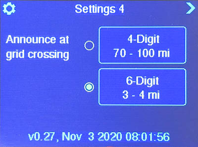
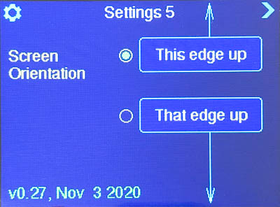

# Griduino User's Guide

This guide applies to Beta Version 0.27 and above.

# 1. Introduction

Thank you for purchasing a Griduino GPS navigation kit. Once assembled, this kit is a useful driver's aid dedicated to show your location in the Maidenhead grid square system, your altitude, the exact time in GMT, barometric pressure and more. Further, the hardware is a highly capable platform for programming your own features.

# 2. Power-up Screens
Griduino will automatically show a few screens in sequence as it powers up. During this time, it does not respond to touches or anything else.

### 2.1 Power-up animation (one time only)
Griduino shows this animation while waiting for a serial monitor port. This allows it time to connect to your computer's serial monitor via a USB connection.

When you cross a grid line, the new grid is announced with CW on the speaker.

When you arrive at a destination, you can switch to the GMT clock view. This is useful to visually compare to your computer clock for accurate time.

### 2.2 Credit screen (one time only)
Griduino will briefly show the author's name and program version number. This is an easy way to know what software is loaded. Later, in the configuration screens, it will show the version number again along with exact date it was compiled.

### 2.3 Help screen (one time only)
Griduino shows a brief reminder of the touch-sensitive areas on the main grid display. Although the later screens include small icon reminders, you may note their touch-sensitive areas really cover most of the screen. Accuracy is not required for a busy driver.

# 3. User Screens
After loading and running the Griduino program, 

* Touch the "next view" arrow in the upper right to advance from one view to the next.
* Touch the "settings" gear in the upper left to advance from one configuration screen to the next.
* Touch the bottom half of the screen to adjust brightness.

### 3.1 Grid location view
Griduino has non-volatile storage to save your breadcrumb trail (driving track) from one day to the next. 

### 3.2 Grid details view

### 3.3 GMT clock view

# 4. Configuration Screens
To cycle among the various configuration screens, repeatedly press the "gear" icon.

To return to the main display screens, press the "next screen" arrow in the upper right.

### 4.1 Select audio volume

*Delete img/view-volume-img7049.jpg*

### 4.2. Select GPS or Demo Mode
For demonstration, bring up the **Settings** view. Change the Route to **Simulator** and return to the main grid view. It follows a pre-programmed route to show the breadcrumb trail and what happens at grid crossings. There are a few different routes available, selectable at compile-time. The most interesting and default canned route will drive at 900 mph in a big ellipse near the edges of one grid square. 

*Delete img/view-settings-img7050.jpg*

### 4.3 Select English or Metric
Although this says "miles" and "kilometers", it actually changes all reported units of all types to English or Metric. That is, the barometric pressure will be shown in "inHg" or "hPa".

### 4.4 Select Audible Announcement Boundaries
You can choose between audible announcements at 4-digit grid boundaries or 6-digit boundaries. Typically:

* 6-meter rovers are interested in distances to the next major grids.
* Microwave rovers often use distance scoring based on 6-digit grid lines and are interested in the next minor boundary. 

When you press one of these buttons, Griduino will play an audible sample of the announcement.

The main grid display continues to show the 4-digit grid. This selection only controls when announcements are made.

### 4.5 Screen Orientation
You can use Griduino in either one of two landscape orientations. This allows you to place its connectors on either side for ease of installing this on your desk or in your vehicle.

# 5. Programming the Griduino GPS

You can find, download and install the latest Griduino program using the latest documentation on GitHub: 

https://github.com/barry-ha/Griduino

For hobbyists interested in a deep dive, [docs/PROGRAMMING.md](https://github.com/barry-ha/Griduino/blob/master/docs/PROGRAMMING.md) has complete Arduino IDE setup and programming instructions. 

# 6. Disclaimer

The information provided is for general education and entertainment. We hope you learn from this and enjoy your hobbies in a safe manner with this new GPS information available at a glance. We take no responsibility for your assembly and construction, nor for how you use these devices. 

**Do not adjust Griduino while driving**. Keep your full attention on the road and the traffic around you. We can not be held responsible for any property or medical damages caused by these projects. You are advised to check your local laws and consult professionals for any project involving electricity, construction or assembly. You are advised to drive in a safe and legal manner, consistent with all local laws, safety rules and good common sense.

You must accept that you and you alone are responsible for your safety and safety of others in all aspects of working with Griduino.
